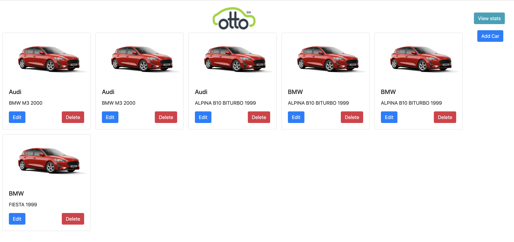
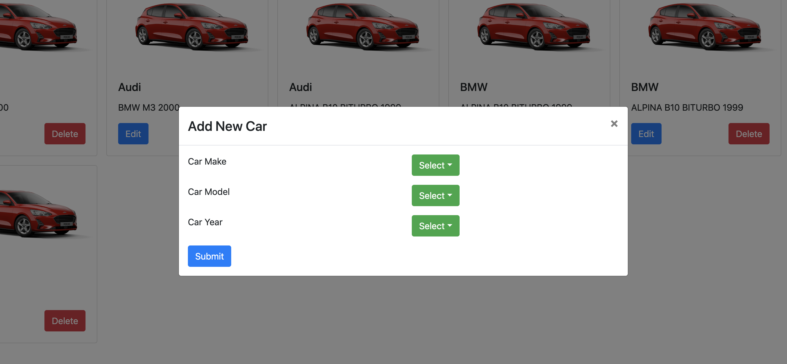
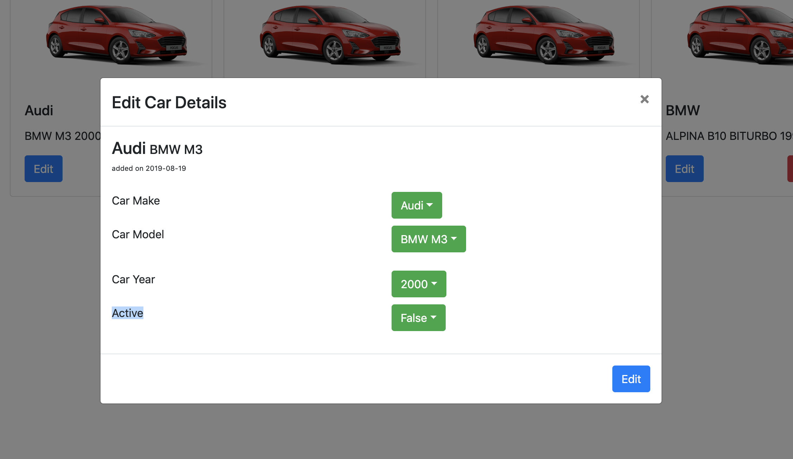
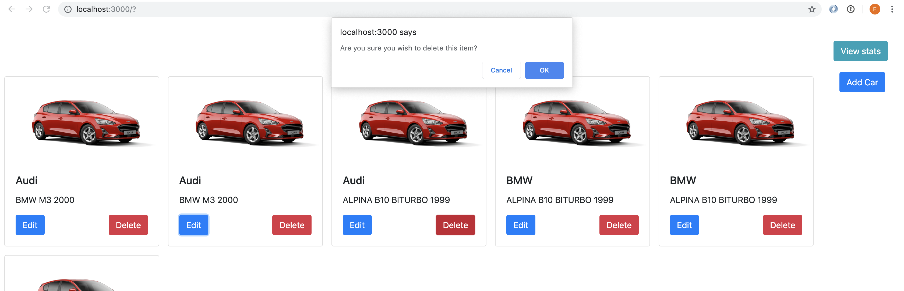
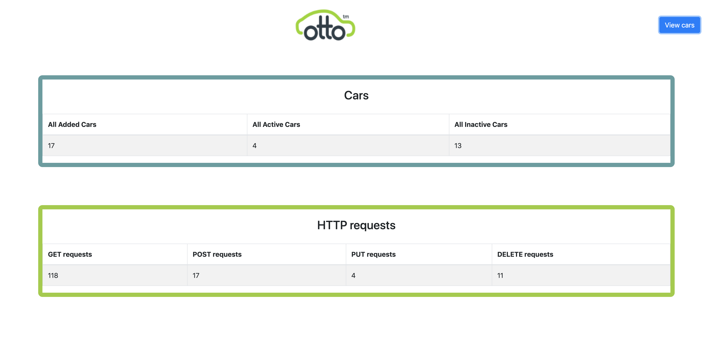

# </a>Otto Car Client

[Test case scenario](#testcase) |
[How to use](#howto)|
[Test](#test) |
[Code Requirements](#reqs)|
[Sample Views](#sample)  

### Introduction  
This is an SPA built with React that utilizes a REST API built with node.

### Test Case Scenario :

**Case 1** User can view all cars  
**Case 2** User can update a car details  
**Case 3** User can delete a car  
**Case 4** User can add a car  
**Case 5** User can view cars stats  
**Case 6** User can view http requests stats  

### How to use :
####Requirement  
You must clone the [ottoCarServer](https://github.com/fabjab86/ottoCarServer) project and run the server locally  
_Step 1_  
`git clone git@github.com:fabjab86/otto-car-client.git`  
_Step 2_  
From the command line type `npm start`  
_Step 3_
The browser will open localhost:3030 then you can interact with the website 

### How to test :
Regretfully there are no tests at the moment 

### Code Requirement :

####Front End
The front-end must contain two views.

The first view (Cars) contains a form and a table, where a user can add and view cars.

The second view (Statistics) contains a table with statistics, described below.  

### Sample Views :

      
    
    
    
    

